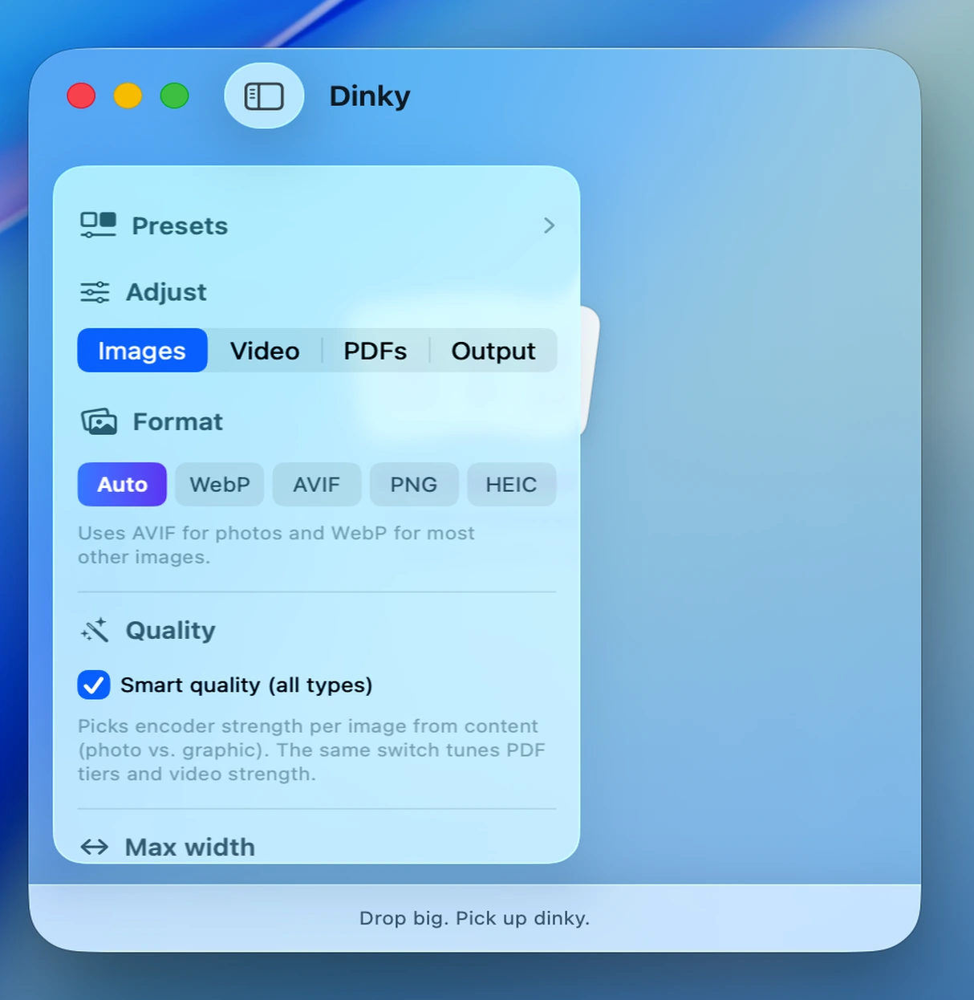

# Dinky

A small macOS utility that compresses **images**, **videos**, and **PDFs**. Drop files in, get smaller ones back.

For images: supports JPG, PNG, WebP, AVIF, TIFF, and BMP. Outputs WebP, AVIF, or lossless PNG depending on your preference. For video: export to MP4 with H.264 or HEVC and quality presets. For PDFs: **flatten pages** (default) for reliable smaller files on most scans and image-heavy documents, or **preserve text and links** for a best-effort stream rewrite when size is secondary. Strips metadata (where applicable), respects max dimensions and file size targets for images, and saves next to the original by default.

<p align="center">
  
  
  
</p>

## Releases

**1.x** (from 1.0 on) was **images only**. **2.0** added **videos and PDFs** alongside images. Older 1.x DMGs and ZIPs stay on [GitHub Releases](https://github.com/heyderekj/dinky/releases) for anyone who needs them; use the [latest release](https://github.com/heyderekj/dinky/releases/latest) for full format support.

## About the developer

Hey! I'm [Derek Castelli](https://www.heyderekj.com), a full-time freelance web designer working primarily in Webflow and Figma (and now more in Cursor and Claude). Image compression is a constant part of the job — every site build involves optimizing photos for fast load times, and doing that by hand in a browser or through a bloated app gets old fast. Dinky came out of that frustration.

## Features

- **Drag and drop** — drop images, videos, or PDFs onto the window, the Dock icon, or the file picker
- **Clipboard compress** — paste a copied image straight into Dinky with ⌘⇧V; the hotkey works system-wide, even when Dinky isn't focused
- **Compress from a URL** — drop or paste a direct `http(s)` link to an image, video, or PDF; Dinky downloads it (max 500 MB) into a temp folder, compresses, and cleans up after itself
- **Format conversion (images)** — Auto, WebP, AVIF, or lossless PNG; Auto picks the right format per image
- **PDF compression** — flatten pages for typical size wins (default), or preserve text and links with best-effort optimization (qpdf + PDFKit)
- **Video compression** — export to MP4 with H.264 or HEVC and quality presets
- **Compression presets** — save named presets with format, quality, limits, destination, watch folder, and filename settings; apply in one click
- **Before & after preview** — side-by-side or slider view to compare original and compressed (images)
- **Watch folder** — point Dinky at a folder and new supported files are compressed automatically; global or per-preset with its own folder
- **Batch speed** — cap parallel jobs: one at a time (Fast), up to three (Faster), or up to eight (Fastest)
- **Batch order** (optional) — start with the largest files first to finish the full batch sooner; default is smallest first for quicker early feedback
- **Max width** — resize on the way out with common web presets or a custom value (images)
- **Max file size** — binary-searches the quality level to hit an exact MB target (images)
- **Batch compression** — multiple files compress concurrently, live results as they finish
- **Manual mode** — drop files first, then right-click each one to choose format individually
- **Show in Finder** — jump straight to any compressed file from the results list
- **PNG lossless** — run oxipng on PNGs when you need to keep transparency or format fidelity
- **Destination** — save next to the original, to Downloads, or pick a custom folder; presets can have their own unique output folder
- **Originals** — keep, move to Trash, or move to a Backup folder of your choosing on every successful compress; set per preset or globally
- **Notifications** — sound and system notification when a batch finishes; sound scales with savings: a soft tink for tiny saves, a full chime for big ones
- **Smart quality** — auto-detects photo vs. graphic (UI, illustration, logo, screenshot) per image and picks quality accordingly; or force Photo, Graphic, or Mixed per preset
- **Session history** — review past compression sessions with file counts and total bytes saved
- **Apple Shortcuts** — compress images from automations via a native Shortcuts action
- **Custom keyboard shortcuts** — rebind Open Files, Clipboard Compress, Compress Now, Clear, and Delete in Settings → Shortcuts
- **Launch at login** — opt in once and Dinky's ready the moment you log in (handy alongside Watch Folders for set-and-forget compression)
- **Easy updating** — one click checks for a new release, installs, and relaunches; no browser, no re-drag
- **Skip threshold** — skip files below a minimum savings target: Off, 2%, 5%, or 10%
- **Advanced** — strip metadata, sanitize filenames for web, open output folder automatically
- **Quirky idle animation** — three choreographed card-drop variants that loop then hold until you come back
- ~28 MB installed (bundled encoders + PDF **qpdf** dylibs). Dinky style.

### What others don't do

- **Actually changes the format (images)** — ImageOptim squeezes your JPEG and hands it back as a JPEG. Dinky converts to WebP, AVIF, or lossless PNG, which is where 30–80% of the real savings live. Optimage does this too, but costs money and weighs 62 MB.
- **Images, videos, and PDFs in one app** — most "compression" apps stop at images. Dinky also re-encodes video to MP4 (H.264 or HEVC) with quality presets, and shrinks PDFs by flattening pages (default) or preserving structure with qpdf-backed stream optimization when you need selectable text. One drop zone, three file types, same workflow.
- **Results you can act on** — most compression apps give you a done screen you can't do anything with. Dinky's results list works like Finder: select files, drag them somewhere else, double-click to open, right-click to remove individual items.
- **Watch folders that actually fit a workflow** — point Dinky at a folder and new files get compressed automatically. Global, or per-preset with its own folder, format, and destination — so screenshots, client video exports, and PDF receipts can all land in different places and come out optimized.
- **Presets for everything, not just quality** — save format, quality, max width, max file size, destination, watch folder, and filename rules together, then apply in one click. Different presets for blog images, social video, and CMS PDFs without touching settings each time.
- **Notifications with a personality** — other apps either don't notify at all or send a generic "Done." Dinky's notification (and chime) changes based on how many files you compressed and how much you saved. Small things, but they add up.
- **Built into macOS** — Finder Quick Action, "Open with" handler, clipboard paste with ⌘⇧V, Dock-icon drops, and a native Apple Shortcuts action for automations. No browser tab, no upload, nothing leaves your Mac.
- **Free, open source, and tiny** — Optimage is $15 and image-only. ImageOptim is free but lossless and image-only. Dinky is free, open source, handles images + video + PDFs, converts formats, and at ~28 MB fits in a fraction of the space Optimage takes up.

## Why it exists

[Optimage](https://optimage.app/) crashed. Instead of finding a replacement, I figured it was a good excuse to build my own — this was my first macOS app.

I liked [Squoosh](https://github.com/GoogleChromeLabs/squoosh) but didn't want to be in a browser every time I needed to compress something. I wanted something that lived on my Mac, stayed out of the way, and just worked.

## How it works

Built entirely in Swift and SwiftUI, targeting macOS 15 Sequoia and later. On macOS 26 Tahoe you get the full liquid glass UI; on Sequoia it uses the frosted material fallback. No Electron, no web views, no third-party UI frameworks, no SPM dependencies. The whole app is ~28 MB, still appropriately dinky.

Compression runs through a native `actor`-based service. **Images** use bundled CLI encoders (cwebp, avifenc, oxipng). **Video** uses AVFoundation export. **PDFs** use **PDFKit** plus **ImageIO** for flattening, and bundled **qpdf** (then PDFKit) on the preserve-text path. See `docs/PDF_COMPRESSION.md` for modes, metrics logging (`pdf_metrics` in Console), and manual fixture checks. Multiple files can run concurrently according to your batch speed setting; heavy PDF flattening and HEIC transcoding run off the actor so parallel slots stay useful, and AVIF encoder threads scale with batch width so many concurrent jobs don’t each claim all cores.

The sidebar stores preferences via `@AppStorage`. The results list updates live as each file finishes. Error details are tappable. The idle animation on the drop zone runs through three choreographed variants then holds — portrait, landscape, and wide cards dragged in by a pinch cursor from whatever corner the window is closest to.

The app registers as an "Open with" handler and exposes a Finder Quick Action so you can compress without opening the app manually.

## Built with

- SwiftUI (macOS 15+, liquid glass on macOS 26)
- AppKit for window and event integration
- `actor` concurrency model for compression
- `@AppStorage` / `UserDefaults` for preferences
- `NSServices` for Finder integration
- Claude Sonnet 4.6, Opus 4.7, and Cursor

## Compression engines

Dinky is a native front-end for these pieces:

- [cwebp](https://developers.google.com/speed/webp) — Google's WebP encoder (BSD)
- [avifenc](https://github.com/AOMediaCodec/libavif) — Alliance for Open Media's AVIF encoder (BSD)
- [oxipng](https://github.com/shssoichiro/oxipng) — lossless PNG optimizer in Rust (MIT)
- [qpdf](https://qpdf.sourceforge.io/) — structural PDF optimization on the preserve-text path (Apache 2.0)
- PDFKit, Core Graphics, and ImageIO — page flatten and PDF rewrite in macOS
- AVFoundation — video export

## Install

Download the DMG and drag Dinky to Applications.

Since the app isn't notarized, macOS may (will probably) block it on first launch. To open it anyway, try launching it once, then go to **System Settings → Privacy & Security**, scroll down, and click **Open Anyway**.

Or skip that entirely and run this in Terminal:
```bash
xattr -dr com.apple.quarantine /Applications/Dinky.app
```

Updating Dinky is one click — no browser, no re-drag, no quarantine step. A banner appears when a new version is out; click **Install Update** and the app downloads, installs, and relaunches on its own.
