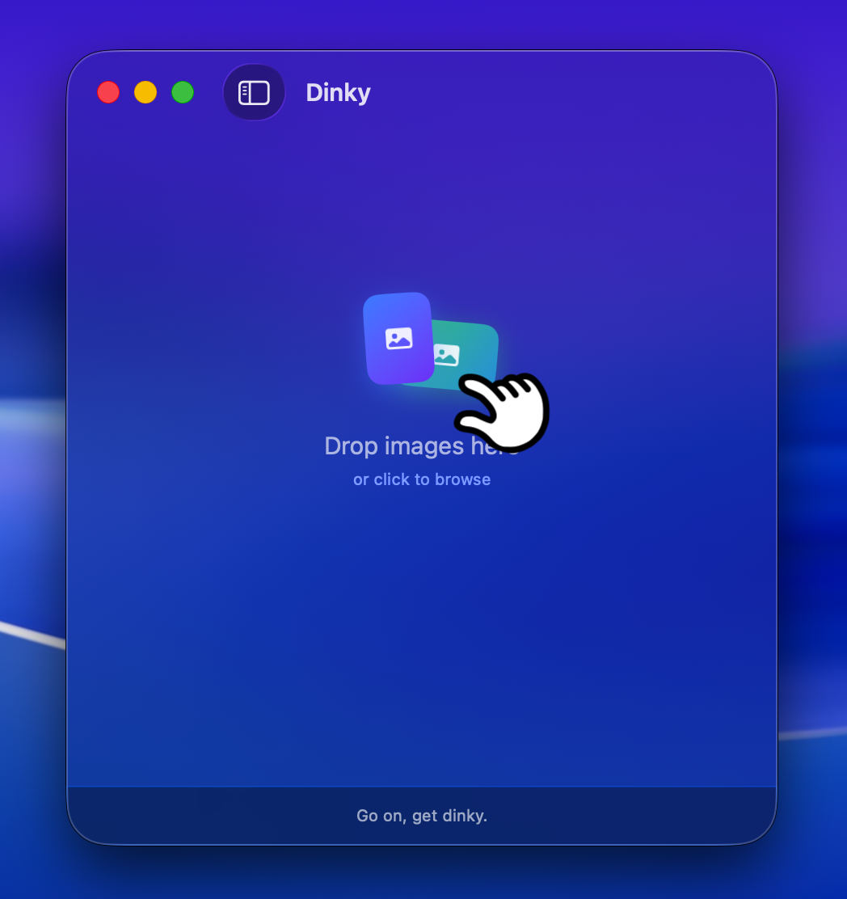

# Dinky

A small macOS utility that compresses images. Drop files in, get smaller ones back.

Supports JPG, PNG, WebP, and AVIF. Outputs WebP, AVIF, or lossless PNG depending on your preference. Strips metadata, respects max dimensions and file size targets, and saves next to the original by default.

<p align="center">
  
  
  
</p>

## About the developer

Hey! I'm [Derek Castelli](https://www.heyderekj.com), a full-time freelance web designer working primarily in Webflow and Figma (and now more in Cursor and Claude). Image compression is a constant part of the job — every site build involves optimizing photos for fast load times, and doing that by hand in a browser or through a bloated app gets old fast. Dinky came out of that frustration.

## Features

- **Drag and drop** — drop images onto the window, the Dock icon, or the file picker
- **Clipboard compress** — paste a copied image straight into Dinky with ⌘⇧V
- **Format conversion** — Auto, WebP, AVIF, or lossless PNG; Auto picks the right format per image
- **Compression presets** — save named presets with format, quality, limits, destination, watch folder, and filename settings; apply in one click
- **Before & after preview** — side-by-side or slider view to compare original and compressed
- **Watch folder** — point Dinky at a folder and new images added are compressed automatically; global or per-preset with its own folder
- **Max width** — resize on the way out with common web presets or a custom value
- **Max file size** — binary-searches the quality level to hit an exact MB target
- **Batch compression** — multiple files compress concurrently, live results as they finish
- **Manual mode** — drop files first, then right-click each one to choose format individually
- **Show in Finder** — jump straight to any compressed file from the results list
- **PNG lossless** — run oxipng on PNGs when you need to keep transparency or format fidelity
- **Destination** — save next to the original, to Downloads, or pick a custom folder; presets can have their own unique output folder
- **Notifications** — sound and system notification when a batch finishes; sound scales with savings: a soft tink for tiny saves, a full chime for big ones
- **Smart quality** — auto-detects photo vs. screenshot per image and picks quality accordingly; or force Photo, UI, or Mixed per preset
- **Session history** — review past compression sessions with file counts and total bytes saved
- **Apple Shortcuts** — compress images from automations via a native Shortcuts action
- **Easy updating** — one click checks for a new release, installs, and relaunches; no browser, no re-drag
- **Skip threshold** — skip files below a minimum savings target: Off, 2%, 5%, or 10%
- **Advanced** — strip metadata, sanitize filenames for web, open output folder automatically, move originals to trash
- **Quirky idle animation** — three choreographed card-drop variants that loop then hold until you come back
- ~14 MB. Dinky style.

### What others don't do

- **Actually changes the format** — ImageOptim squeezes your JPEG and hands it back as a JPEG. Dinky converts to WebP, AVIF, or lossless PNG, which is where 30–80% of the real savings live. Optimage does this too, but costs money and weighs 62 MB.
- **Results you can act on** — most compression apps give you a done screen you can't do anything with. Dinky's results list works like Finder: select files, drag them somewhere else, double-click to open, right-click to remove individual items.
- **Notifications with a personality** — other apps either don't notify at all or send a generic "Done." Dinky's notification changes based on how many files you compressed and how long it took. Small things, but they add up.
- **Free, open source, and tiny** — Optimage is $15. ImageOptim is free but lossless only. Dinky is free, open source, converts formats, and at ~14 MB fits in a fraction of the space either of them takes up.

## Why it exists

[Optimage](https://optimage.app/) crashed. Instead of finding a replacement, I figured it was a good excuse to build my own — this was my first macOS app.

I liked [Squoosh](https://github.com/GoogleChromeLabs/squoosh) but didn't want to be in a browser every time I needed to compress something. I wanted something that lived on my Mac, stayed out of the way, and just worked.

## How it differs from ImageOptim and Optimage

[ImageOptim](https://imageoptim.com/mac) is lossless only — it makes your JPEG or PNG smaller without changing the format. Optimage does lossy and lossless but also mostly keeps you in the source format. Both are good at what they do.

Dinky takes a different approach: it converts to WebP, AVIF, or lossless PNG. The format change is where most of the real savings come from — often 30–80% smaller than a JPEG or PNG at the same visual quality. And when you need to keep the PNG format (transparency, UI assets, icons), oxipng squeezes it losslessly without touching a pixel. If you're putting images on the web or into a CMS and you're still working with JPEGs and PNGs, converting the format matters more than squeezing the existing one.

## How it works

Built entirely in Swift and SwiftUI, targeting macOS 15 Sequoia and later. On macOS 26 Tahoe you get the full liquid glass UI; on Sequoia it uses the frosted material fallback. No Electron, no web views, no third-party UI frameworks, no SPM dependencies. The whole app is ~14 MB, appropriately dinky.

Compression runs through a native `actor`-based service that shells out to platform image tools, keeping the main thread free. Multiple files compress concurrently up to the core count of the machine. Output quality is tuned automatically to hit the target file size if one is set.

The sidebar stores preferences via `@AppStorage`. The results list updates live as each file finishes. Error details are tappable. The idle animation on the drop zone runs through three choreographed variants then holds — portrait, landscape, and wide cards dragged in by a pinch cursor from whatever corner the window is closest to.

The app registers as an "Open with" handler and exposes a Finder Quick Action so you can compress without opening the app manually.

## Built with

- SwiftUI (macOS 15+, liquid glass on macOS 26)
- AppKit for window and event integration
- `actor` concurrency model for compression
- `@AppStorage` / `UserDefaults` for preferences
- `NSServices` for Finder integration
- Claude Sonnet 4.6 and a bit of Opus 4.7

## Compression engines

Dinky is a native front-end for these open-source CLI tools, which do the actual work:

- [cwebp](https://developers.google.com/speed/webp) — Google's WebP encoder (BSD)
- [avifenc](https://github.com/AOMediaCodec/libavif) — Alliance for Open Media's AVIF encoder (BSD)
- [oxipng](https://github.com/shssoichiro/oxipng) — lossless PNG optimizer in Rust (MIT)

## Install

Download the DMG and drag Dinky to Applications.

Since the app isn't notarized, macOS may (will probably) block it on first launch. To open it anyway, try launching it once, then go to **System Settings → Privacy & Security**, scroll down, and click **Open Anyway**.

Or skip that entirely and run this in Terminal:
```bash
xattr -dr com.apple.quarantine /Applications/Dinky.app
```

Updating Dinky is one click — no browser, no re-drag, no quarantine step. A banner appears when a new version is out; click **Install Update** and the app downloads, installs, and relaunches on its own.
